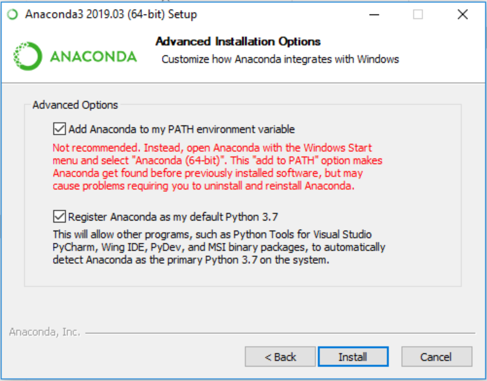

Data Analytics - Structured Data
================================

How to analyze Structured Data using Python
-------------------------------------------

---

introduction about this course

### Prerequisites

#### Theoretical things

-	Read about Mathematics & Statistics for Data Science
	- Lecture Slides : [Google Drive](https://drive.google.com/drive/folders/1eTzbDFbp0bPraxQFJadTlGp_o-hrnvbC)
	- Data Science School : https://datascienceschool.net/view-notebook/04358acdcf3347fc989c4cfc0ef6121c/
	- Online Graphing Calculator : https://www.desmos.com/calculator

#### Technical things

-	Python : <a href="./prerequisites1 - python.ipynb">Prerequisite 1 - Python Notebook</a>
-	IPython & Jupyter Notebook : <a href="./prerequisites2 - python data science environment.ipynb">Prerequisite 2 - Python Data Science Environment Notebook</a>
-	NumPy : <a href="./prerequisites3 - numpy.ipynb">Prerequisite 3 - NumPy Notebook</a>
-	Pandas : <a href="./prerequisites4 - pandas.ipynb">Prerequisite 4 - Pandas Notebook</a>
-	Matplotlib : https://matplotlib.org
	- [Reference - Plots with Matplotlib](https://datascienceschool.net/view-notebook/6e71dbff254542d9b0a054a7c98b34ec/)
-	Seaborn : https://seaborn.pydata.org
	- [Reference - Visualizaiton with Seaborn](https://datascienceschool.net/view-notebook/4c2d5ff1caab4b21a708cc662137bc65/)
-	Scikit-learn : https://scikit-learn.org/stable/

### Project Details

For this project, we will use DataSets in Kaggle Competition.

---

### Getting Started

Follow the steps below!

#### Step 1: Data Analytics Workflow

General Data Analytics Workflow

#### Step 2: Regression

Boston Housing : Predicting Boston Housing Prices https://www.kaggle.com/samratp/boston-housing-prices-evaluation-validation

Ames House Prices: Advanced Regression Techniques(https://www.kaggle.com/c/house-prices-advanced-regression-techniques/overview)

#### Step 3: Classification

Titanic: Machine Learning from Disaster https://www.kaggle.com/c/titanic

#### Step 4: Clustering

Mall Customer Segmentation Data Market Basket Analysis https://www.kaggle.com/vjchoudhary7/customer-segmentation-tutorial-in-python

---

### Instructions

To setup our project environment to run the code in this repository, follow the instructions below.


1. Install Git
	-	Linux: https://www.atlassian.com/git/tutorials/install-git#linux
	- Mac: https://www.atlassian.com/git/tutorials/install-git#mac-os-x
	-	Windows: https://www.atlassian.com/git/tutorials/install-git#windows
		- [Download for Windows](https://drive.google.com/file/d/1FIElyMq4C1M0sVyEAtJ61jb8NRFowPtI/view?usp=sharing)
2. Install Anaconda
	-	Linux: https://docs.anaconda.com/anaconda/install/linux/
	- Mac: https://docs.anaconda.com/anaconda/install/mac-os/
		- [Download for Mac](https://drive.google.com/file/d/1HVymmlUe5_wLMvNrEGxYwLNnya6vhNpz/view?usp=sharing)
	-	Windows: https://docs.anaconda.com/anaconda/install/windows/
		- [Download for Windows](https://drive.google.com/open?id=1CPwcFLmzUYKhdKCRD8NrH4RKaLAefEbk)
		- Anaconda for Windows 설치시 주의사항
			* 설치시 'Advanced Options' 단계에서 'Add Anaconda to my PATH environment variable' 옵션을 체크합니다.(Windows의 Default Command Prompt에서 Anaconda 명령어를 사용하기 위함입니다.)
			
3.	Clone this repository
	- [Reference #1 : Intorduction to Git for Data Science](https://www.datacamp.com/courses/introduction-to-git-for-data-science)
	- [Reference #2 : Git the simple guide](https://rogerdudler.github.io/git-guide/index.ko.html)

```
git clone https://github.com/parksurk/da_structured-data.git
```
4.	Create (and activate) a new environment with Python 3.6.
	-	Linux or Mac:
		```
		conda create --name kaggle python=3.6
		source activate kaggle
		```
	-	Windows:
		```
		conda create --name kaggle python=3.6
		activate kaggle
		```
5.	Install Python Scientific Libraries

```
pip install jupyter numpy pandas matplotlib seaborn scikit-learn scipy plotly cufflinks tqdm
```

6.	Install Etc Libraries like XGBoost, LightGBM, graphviz, python-graphviz

	-	Linux or Mac:
		```
		conda install -c conda-forge xgboost lightgbm graphviz python-graphviz
		```
	-	Windows:
		```
		conda install -c anaconda py-xgboost
		conda install -c conda-forge lightgbm graphviz python-graphviz
		```

7. Install [RISE](https://github.com/damianavila/RISE) - Jupyter notebook slideshow library (Optional for Presenter)

```
conda install -c conda-forge rise
```

8.	Create an IPython kernel for the kaggle environment. (Skip if you done already)

```
pip install ipykernel
python -m ipykernel install --user --name kaggle --display-name "kaggle"
```

9.	Run Jupyter Notebook

```
jupyter notebook
```

10.	Click **.ipynb** on root directory

11.	Before running code in a notebook, change the kernel to match the 'kaggle' environment by using the drop-down Kernel menu.
